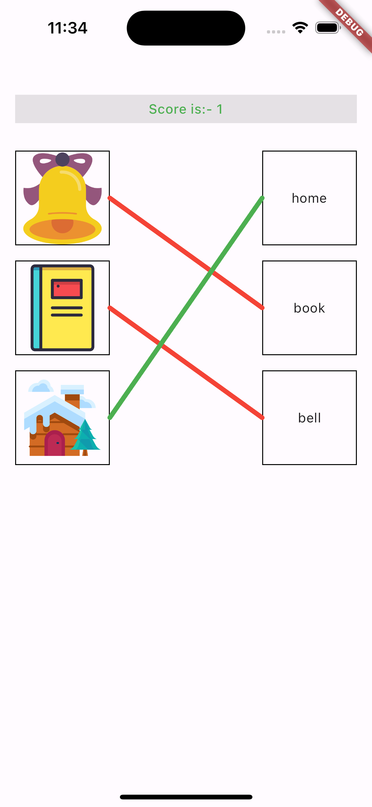
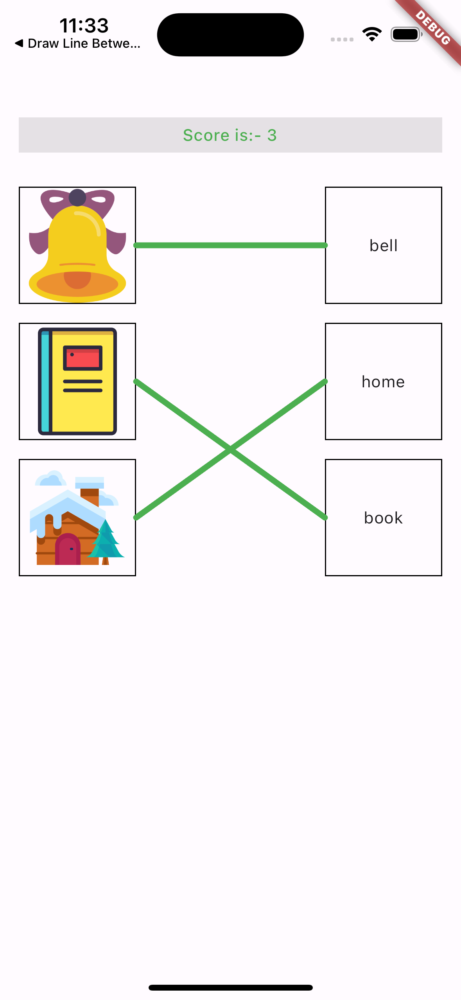

# Flutter Quiz Matcher

<a href="https://flutter.dev/"></a>
<a href="https://dart.dev"></a>
<a href="https://developer.android.com" style="pointer-events: stroke;" target="_blank">

</a>
<a href="https://developer.apple.com/ios/" style="pointer-events: stroke;" target="_blank">

</a>
<a href="" style="pointer-events: stroke;" target="_blank">

</a>
<a href="" style="pointer-events: stroke;" target="_blank">

</a>
<a href="" style="pointer-events: stroke;" target="_blank">

</a>
<a href="" style="pointer-events: stroke;" target="_blank">

</a>

Flutter Quiz Matcher package offers a seamless solution for developers to implement engaging drag-and-match functionality in their Flutter applications. Enhanced with gesture detection, users can intuitively match items through drag-and-drop interactions. What sets this package apart is its unique feature of drawing dynamic lines between matched widgets, providing a visually appealing and interactive experience.

# Screen Shots
<table>
  <tr>
    <td></td>
    <td></td>
    <td></td>
  </tr>
 </table>

## Features
* Effortlessly integrate drag-and-match functionality into your Flutter app, allowing users to interactively match items through dragging and dropping.
* Enhance user experience by incorporating gesture detection, including swipes, taps, and other custom gestures, providing a more intuitive and immersive gaming experience.
* Tailor the appearance and behavior of drag-and-match components to align with your app's design and requirements. Customize gesture recognition settings for a personalized touch.
* Designed for seamless integration into existing Flutter projects, the package offers a straightforward API and documentation to help developers quickly implement drag-and-match features.
* Flutter's cross-platform nature ensures that the Drag and Match package can be used on both iOS and Android devices.

## Getting Started

Add the dependency in `pubspec.yaml`:

```yaml
dependencies:
  flutter_quiz_matcher: ^1.0.0
```
## Usage

### Example
```dart
       QuizMatcher(questions: [
          Container(
            decoration: BoxDecoration(border: Border.all(width: 1, color: Colors.black)),
            width: 100,
            height: 100,
            child: Image.asset(listImagesLocations[0]),
          ),
          Container(
            decoration: BoxDecoration(border: Border.all(width: 1, color: Colors.black)),
            width: 100,
            height: 100,
            child: Image.asset(listImagesLocations[1]),
          ),],
        answers: [
          Container(
            alignment: Alignment.center,
            decoration: BoxDecoration(border: Border.all(width: 1, color: Colors.black)),
            width: 100,
            height: 100,
            child: Text(listAnswer[0]),
          ),
          Container(
            alignment: Alignment.center,
            decoration: BoxDecoration(border: Border.all(width: 1, color: Colors.black)),
            width: 100,
            height: 100,
            child: Text(listAnswer[1]),
          ),],
        defaultLineColor: Colors.black,
        correctLineColor: Colors.green,
        incorrectLineColor: Colors.red,
        drawingLineColor: Colors.black,
        onScoreUpdated: (UserScore userAnswers) {
          print(userAnswers.questionIndex);
          print(userAnswers.questionAnswer);
        },
        paddingAround: EdgeInsets.all(8),
      );
```

## Note:
The result returns in model in every time user connect with any matches. so it can be lost later, you are responsible for storing it somewhere permanent (if needed).

## Guideline for contributors
Contribution towards our repository is always welcome, we request contributors to create a pull request to the develop branch only.

## Guideline to report an issue/feature request
It would be great for us if the reporter can share the below things to understand the root cause of the issue.
- Library version
- Code snippet
- Logs if applicable
- Device specification like (Manufacturer, OS version, etc)
- Screenshot/video with steps to reproduce the issue

# LICENSE!
Flutter Quiz Matcher is [MIT-licensed](https://github.com/mi-raj04/flutter_quiz_matcher/blob/main/LICENSE).

# Let us know!
We’d be really happy if you send us links to your projects where you use our component. Just send an email to sales@mindinventory.com And do let us know if you have any questions or suggestion regarding our work.
